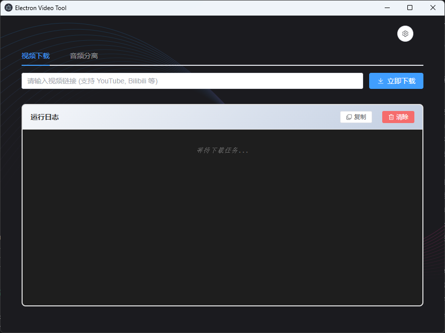

# Electron Video Tool

一个基于 Electron + Vue + TypeScript 构建的视频下载和音频分离工具。

## 界面截图


## ✨ 功能特性

- **视频下载**：支持从 YouTube、Bilibili 等多个视频平台下载视频
- **音频分离**：使用 AI 技术（Demucs）将音频/视频文件中的人声与背景音乐分离
- **实时日志**：提供详细的运行日志，便于追踪任务进度
- **跨平台**：支持 Windows、macOS 和 Linux

## 🛠️ 技术栈

- **框架**: Electron 39.x
- **前端**: Vue 3 + TypeScript
- **UI 库**: Element Plus
- **构建工具**: Vite
- **音频分离**: Demucs (AI 模型)
- **视频下载**: yt-dlp

## 📦 安装

### 前置依赖

确保你的系统已安装以下依赖：

- Node.js >= 18.0.0
- Python >= 3.8 (用于音频分离)
- yt-dlp (用于视频下载)

### 安装步骤

```bash
# 克隆项目
git clone https://github.com/your-username/electron-video-tool.git
cd electron-video-tool

# 安装依赖
npm install

# 安装 yt-dlp（用于视频下载）
# macOS/Linux
pip install yt-dlp

# Windows
pip install yt-dlp
```

## 🚀 快速开始

### 开发模式

```bash
npm run dev
```

### 构建生产版本

```bash
# Windows
npm run build:win

# macOS
npm run build:mac

# Linux
npm run build:linux
```

## 📖 使用说明

### 视频下载

1. 在「视频下载」标签页中输入视频链接
2. 点击「立即下载」按钮
3. 等待下载完成，可通过日志查看进度
4. 下载完成后点击「打开输出目录」查看文件

### 音频分离

1. 在「音频分离」标签页中选择音频/视频文件
2. 点击「开始分离」按钮
3. 首次使用会自动安装 Demucs（可能需要几分钟）
4. 分离完成后会生成两个文件：
   - `vocals.mp3` - 人声
   - `no_vocals.mp3` - 背景音乐

## 📁 项目结构

```
electron-video-tool/
├── src/
│   ├── main/           # 主进程代码
│   │   └── index.ts    # 主进程入口
│   ├── preload/        # 预加载脚本
│   │   └── index.ts    # 暴露 API 给渲染进程
│   └── renderer/       # 渲染进程代码
│       └── src/
│           ├── App.vue # 主应用组件
│           └── main.ts # 渲染进程入口
├── scripts/
│   └── audio_separator.py  # 音频分离脚本
├── resources/          # 资源文件
├── build/              # 构建配置
└── electron.vite.config.ts # Electron Vite 配置
```

## 🔧 配置说明

### 输出目录

默认输出目录为系统下载文件夹：
- Windows: `C:\Users\<用户名>\Downloads\yt-dlp-downloads`
- macOS: `/Users/<用户名>/Downloads/yt-dlp-downloads`
- Linux: `~/Downloads/yt-dlp-downloads`

### Demucs 模型

音频分离使用 Demucs 的默认模型，首次运行会自动下载模型文件（约 500MB）。

## 🤝 贡献

欢迎提交 Issue 和 Pull Request！

## 📄 许可证

MIT License

## 🙏 致谢

- [Electron](https://www.electronjs.org/) - 跨平台桌面应用框架
- [Vue.js](https://vuejs.org/) - 渐进式 JavaScript 框架
- [Demucs](https://github.com/facebookresearch/demucs) - AI 音频分离模型
- [yt-dlp](https://github.com/yt-dlp/yt-dlp) - 强大的视频下载工具
- [Element Plus](https://element-plus.org/) - Vue 3 UI 组件库

---

**注意**: 请遵守相关法律法规，仅下载和处理你有权使用的视频和音频内容。
